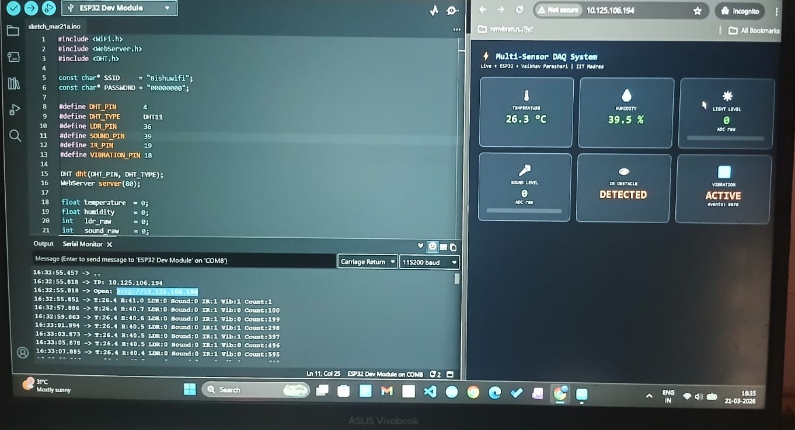
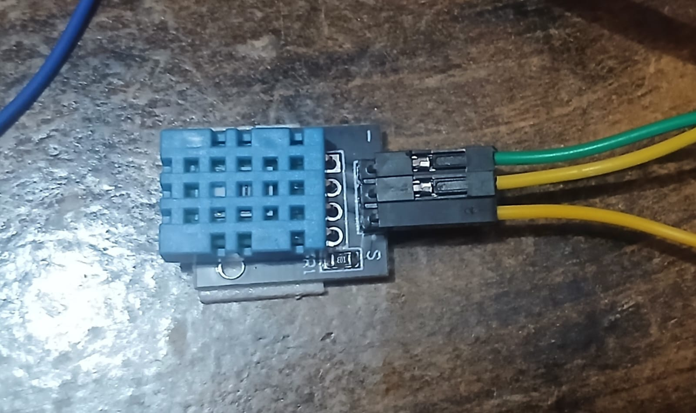
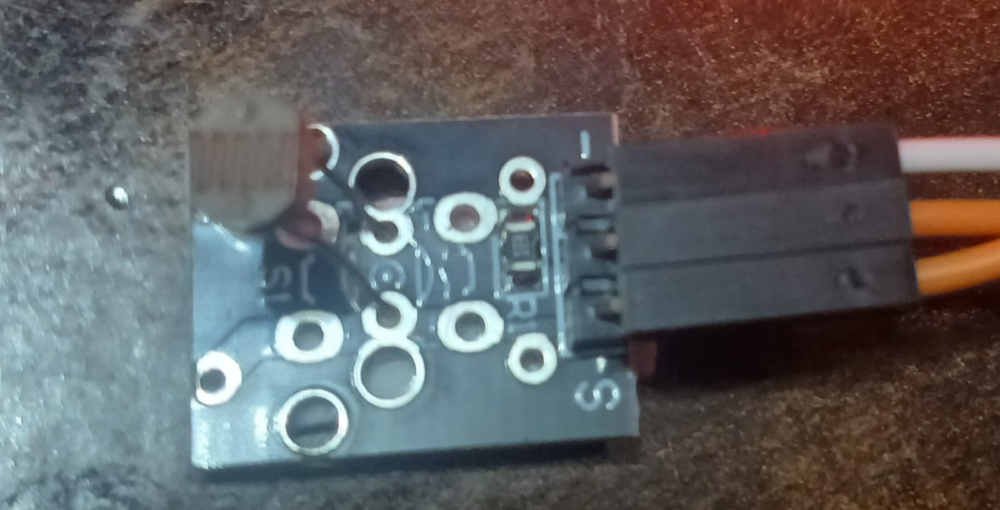
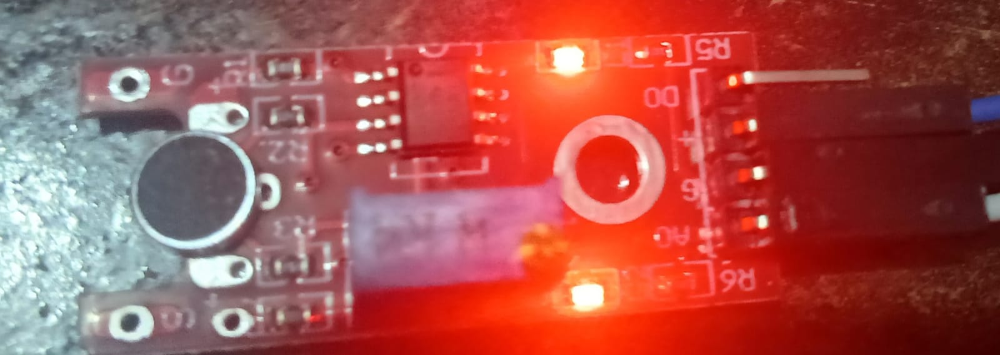
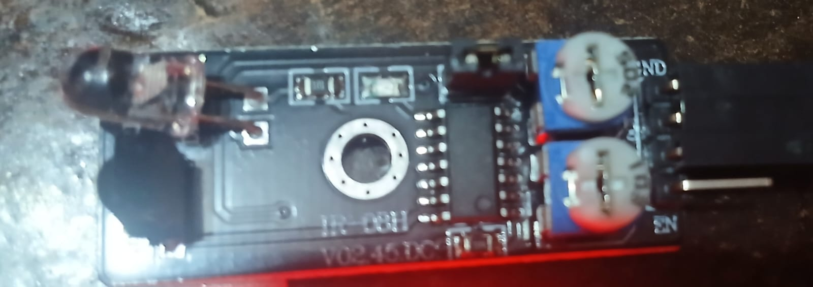
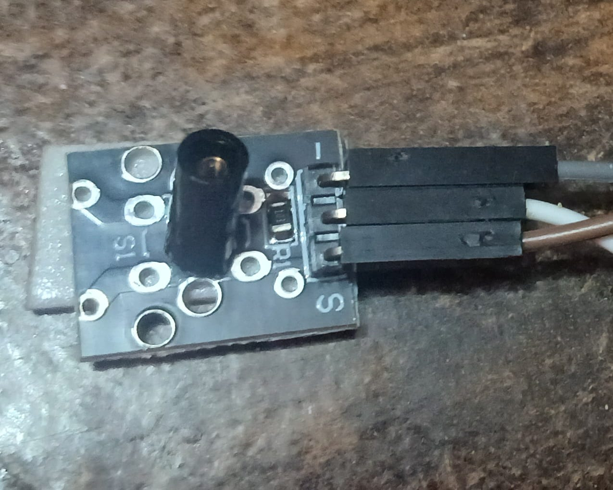

# Sensor Data Acquisition System — ESP32

**Multi-Sensor IoT Dashboard + Strain Gauge Quarter-Bridge DAQ**

> Real-time sensor data acquisition, web dashboard visualization, and strain gauge signal conditioning — built on ESP32.


## Projects in This Repo

| Sub-project | Status | Hardware |
|---|---|---|
| Multi-Sensor IoT Dashboard | ✅ Complete | ESP32 + DHT11, HC-SR04, MQ-2, IR, Soil Moisture |
| Strain Gauge Quarter-Bridge DAQ | ✅ Simulated (Wokwi) / 🔧 Hardware incoming | ESP32 + AD620 + 120Ω foil gauge |

---

## Strain Gauge Quarter-Bridge DAQ

### Signal Chain
```
Strain Gauge (120Ω ± ΔR)
        │
Wheatstone Quarter-Bridge (3× 120Ω precision)
        │  ΔV = (Vex/4) × (ΔR/R)
        ▼
AD620 Instrumentation Amplifier (G = 495, Rg = 100Ω)
        │  Vout = G × ΔV
        ▼
ESP32 ADC GPIO34 (12-bit, 64-sample averaging)
        │
        ▼
Microstrain: µε = (4 × ΔV) / (G × GF × Vex) × 10⁶
```

# Wokwi Simulation
→ [Open Wokwi Simulation](https://wokwi.com/projects/459049362772922369)**

---

# Multi-Sensor Dashboard

# Sensors & Pins
| Sensor | Parameter | ESP32 Pin |
|---|---|---|
| DHT11 | Temperature (°C), Humidity (%) | GPIO4 |
| HC-SR04 | Distance (cm) | TRIG: GPIO5, ECHO: GPIO18 |
| MQ-2 | Gas / Smoke (ADC raw) | GPIO36 |
| IR Obstacle | Proximity (digital) | GPIO19 |
| Soil Moisture | Moisture level (ADC raw) | GPIO39 |

## Live Demo



## Hardware Setup
| Sensor | Photo |
|---|---|
| DHT11 |  |
| LDR |  |
| Sound Sensor |  |
| IR Sensor |  |
| Vibration |  |

# Quick Start
1. Open `firmware/multi_sensor_dashboard/multi_sensor_dashboard.ino`
2. Set your `SSID` and `PASSWORD`
3. Flash to ESP32
4. Open browser → `http://<ESP32_IP>/`

---

## Repository Structure
```
sensor-daq-esp32/
├── firmware/
│   ├── multi_sensor_dashboard/
│   │   └── multi_sensor_dashboard.ino
│   └── strain_gauge_sim/
│       └── strain_gauge_sim.ino
├── simulation/
│   ├── diagram.json
│   └── WOKWI_GUIDE.md
├── docs/
│   ├── circuit_diagram.md
│   └── calibration.md
└── analysis/
    └── plot_data.py
```

---

## Author
Vaibhav Parashari 
  
[github.com/Bishu-crypto](https://github.com/Bishu-crypto)